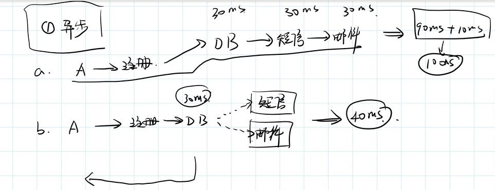
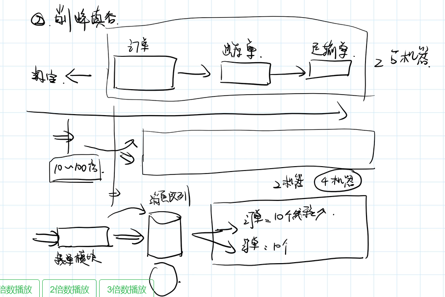
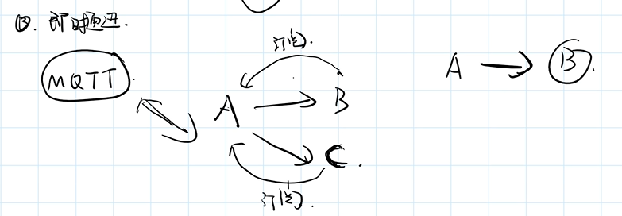
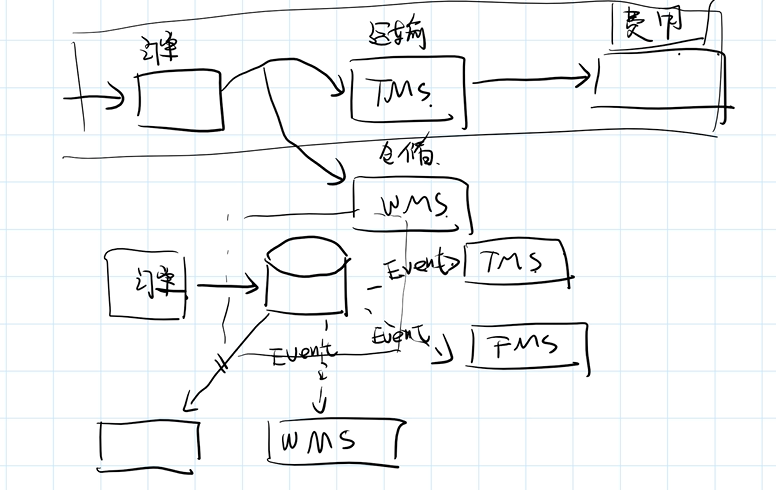
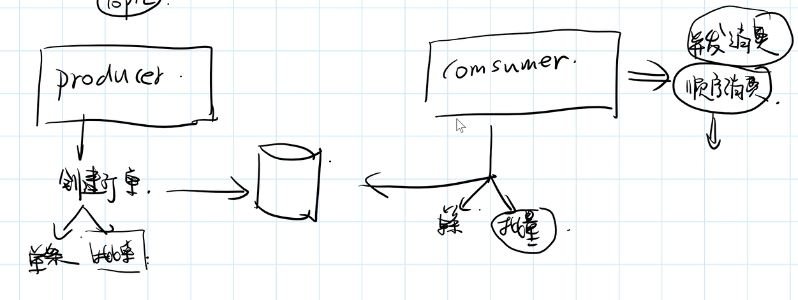
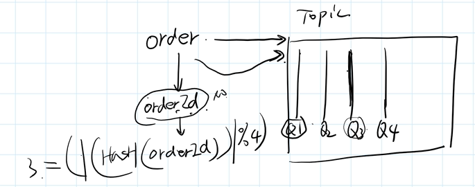

### 基本看完了入职培训视频《EC+angular+数据服务》


#### 1、消息队列使用

##### 1）使用场景

###### ①异步：用户A使用注册操作为例

* 方式一：三步：一步是将信息写入DB，二是发送到短信，三发送到邮箱
* 方式二：将信息写入DB，然后发送到短信或者邮箱（异步）



###### ②削峰填谷

​			淘宝方式：订单-->出库单-->运输单。平时够用，但是双11不够

​			解决方式：在外面专门有一个接单模块，只做往消息队列发生订单信息操作。




###### ③及时通讯

​	A向B发送消息，场景一：当B不在线时也可以接收消息（异步处理）

​								场景二：当B不在线可能会出问题。



###### ④解耦

​		微服务化后会把每个系统拆分为多个独立模块，不希望相互干扰

​		当模块a需要驱动模块b去做一些操作的时候，可以用消息队列。

​	例子：物流行业订单模块、运算模块、费用模块、存储模块。（上普通方式，下面微服务解耦）




消息队列逻辑




##### 2）ProducerService 

###### ①Key

* #p0.orderId

* message.body.orderId

###### ②transaction（事物处理）

只有正常提交的事物，才能把这部分消息发送到消息队列里，保证消息对列和数据库事物的一致性

###### ③tags

通过tags设置区分一些业务上的使用场景


###### ④topic 1<-->n group




##### 3)消息幂等处理

通过消息唯一性ID


#### 2、规则编号使用


#### 3、二级缓存使用

spring内部缓存（CacheManager）、redis、cpu、磁盘


#### 4、注册中心集成

eureka

①配置eureka

```
eureka:
  client:
    serviceUrl:
      defaultZone: http://train.eds.dps.gillion.com.cn/eureka/
  instance:
    # 优先使用IP地址方式进行注册服务
    prefer-ip-address: true
```

②定义logger（log4j2-spring.xml）

```
<logger name="org.springframework.cloud.netflix.eureka" level="DEBUG"></logger>
<logger name="com.netflix.eureka" level="DEBUG"/>
```


#### 5、eds服务网关对接

①修改微服务名称

②http://train.eds-ui.dps.gillion.com.cn/#/gateway

②rest.http添加GET http://train.eds.dps.gillion.com.cn/http/ec-demo/cache/users/wengms

③nginx修改代理网站proxy_pass train.eds.dps.gillion.com.cn/http/ec-demo;


##### 6、服务调用对接


基本看完了入职培训视频《EC+angular+数据服务》

问题一：跟着视频《eds服务网关对接》做但是不能访问本地GET http://train.eds.dps.gillion.com.cn/http/ec-demo/cache/users/wengms

问题二：由于问题一没解决导致视频《服务调用对接》中的类容无法进行下去（视频看了）
问题三：组合练习有点懵

希望明天能彻底结束《EC+angular+数据服务》

总结：痛苦

