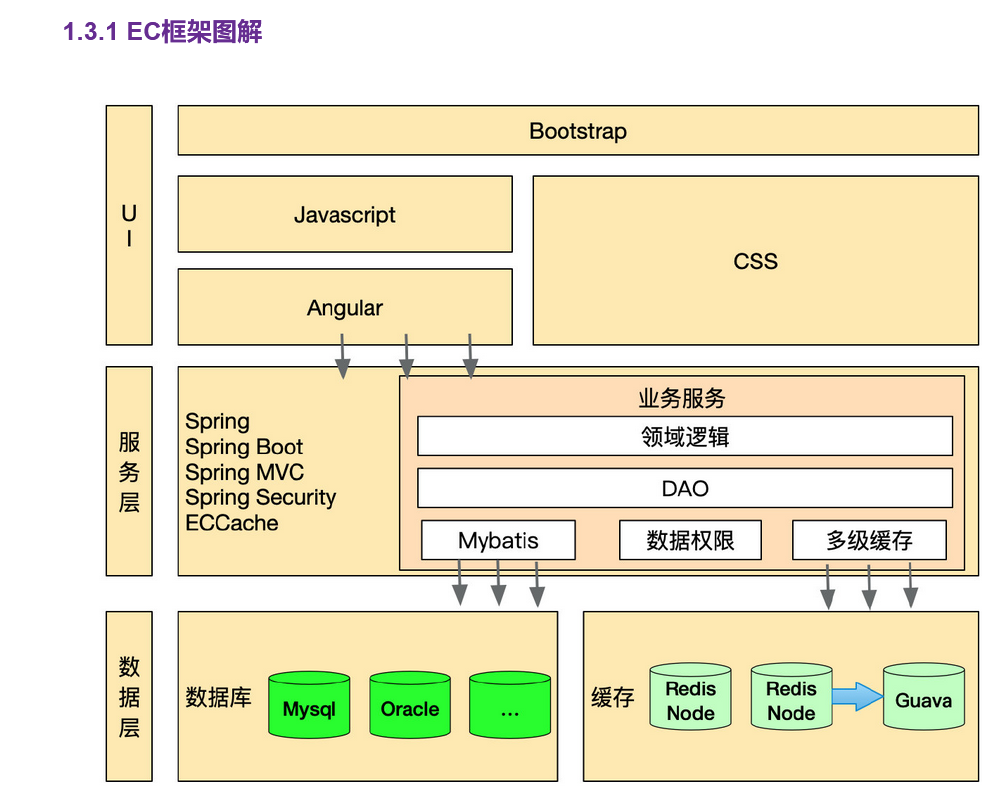
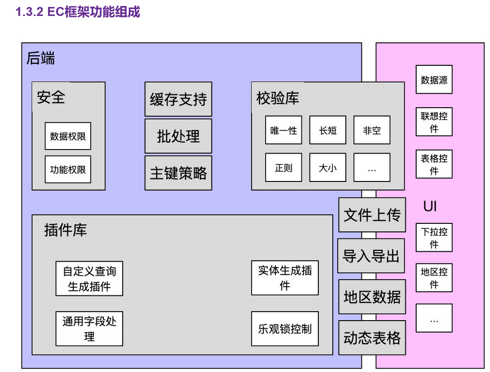
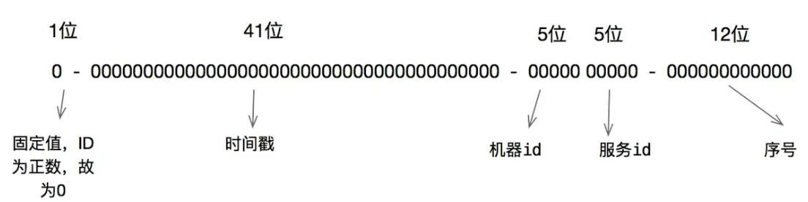

1、ORM框架（mybatis）
2、MVVM开发模式（Angular，vue）

3、Bootstrap来自 Twitter，是目前最受欢迎的**响应式**前端框架，基于 HTML、CSS、JavaScript。

4、springsecurity底层实现为一条过滤器链，就是用户请求进来，判断有没有请求的权限，抛出异常，[重定向](https://so.csdn.net/so/search?q=重定向&spm=1001.2101.3001.7020)跳转。

5、ECCcache：缓存

6、Directive：指令

6、redis作为一级缓存，Guava作为二级缓存。

7、雪花算法

8、StudentExample：用来拼接动态的where子句