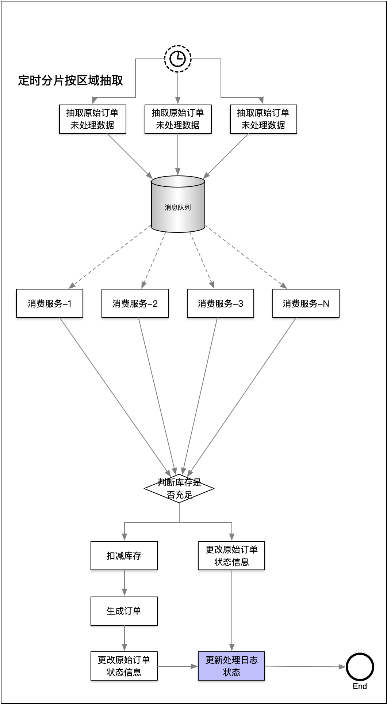

### 1.1、表结构

pre_order(原始订单)表:

| 字段          | 类型         | 说明                                           |
| ------------- | ------------ | ---------------------------------------------- |
| pre_order_id  | bigint       | 主键                                           |
| order_code    | varchar(64)  | 订单号：**生成规则为：来源code+yyyyMMdd+SN:6** |
| source_code   | varchar(8)   | 来源                                           |
| sku_code      | varchar(64)  | sku代码                                        |
| area_code     | varchar(64)  | 区域代码                                       |
| customer_code | varchar(64)  | 客户代码                                       |
| quantity      | int          | 货品数量                                       |
| address       | varchar(128) | 送货地址                                       |
| create_time   | date         | 创建时间                                       |
| status        | int          | 状态：未处理=1，处理完成=2，处理失败=3         |

order_source（订单来源）表

| 字段            | 类型       | 说明       |
| --------------- | ---------- | ---------- |
| order_source_id | bigint     | 主键       |
| source_code     | varchar(8) | 来源code   |
| channel_id      | int        | 来源通道ID |

customer（客户）表

| 字段          | 类型        | 说明     |
| ------------- | ----------- | -------- |
| Customer_id   | bigint      | 主键     |
| Customer_code | varchar(64) | 客户代码 |
| channel_id    | int         | 通道ID   |

sku（库存标识）表

| 字段        | 类型        | 说明    |
| ----------- | ----------- | ------- |
| Sku_id      | bigint      | 主键    |
| customer_id | bigint      | 客户id  |
| Sku_code    | varchar(64) | sku编码 |

 

stock（库存）表

| 字段        | 类型   | 说明     |
| ----------- | ------ | -------- |
| stock_id    | bigint | 主键     |
| customer_id | bigint | 客户id   |
| sku_Id      | bigint | Sku_id   |
| Stock_count | int    | 库存数量 |

order_list（订单）表

| 字段            | 类型        | 说明                                                         |
| --------------- | ----------- | ------------------------------------------------------------ |
| order_id        | bigint      | 订单ID                                                       |
| order_code      | varchar(64) | 订单号                                                       |
| order_source_id | bigint      | 订单来源id                                                   |
| sku_id          | bigint      | skuid                                                        |
| customer_id     | bigint      | 客户id                                                       |
| Area_code       | varchar(64) | 地区编码                                                     |
| quantity        | int         | 货品数量                                                     |
| address         | varchar(64) | 送货地址                                                     |
| Create_time     | date        | 创建时间                                                     |
| aging_time      | date        | 时效时间                                                     |
| status          | Int         | 未处理订单=0x1，时效已生成=0x2，履行序列已生成=0x4，地址解析已完成=0x8 |

 

 

 

### 1.2、处理逻辑

1、假设原始订单表中有100W数据，根据以上表结构，将原始订单的信息生成订单，并存入数据库中

2、在存入时需要根据sku_id扣减库存表中对应的库存，如果库存小于0则订单创建失败

 

### 1.3、处理方式

