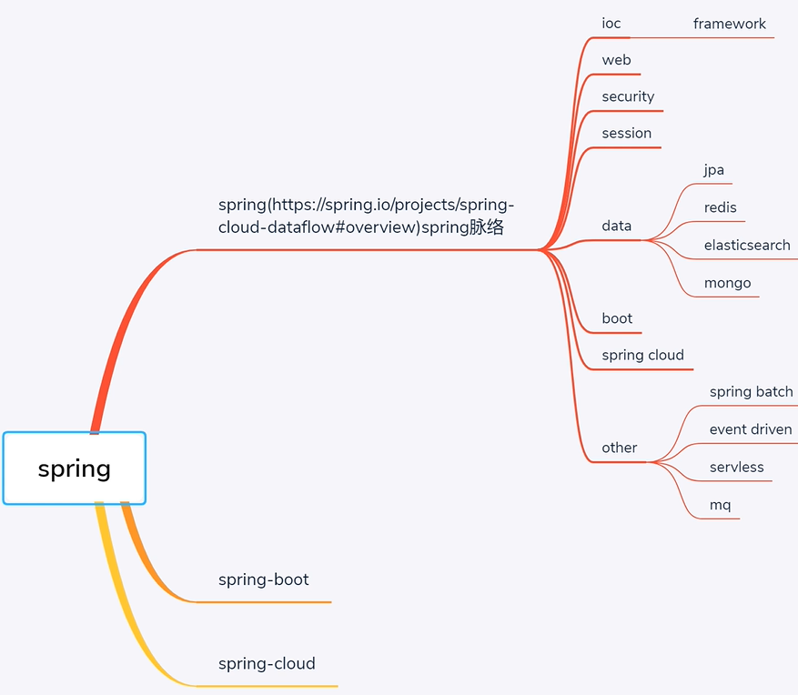
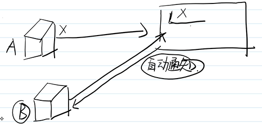
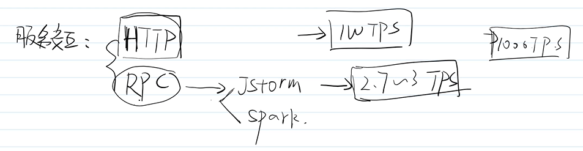
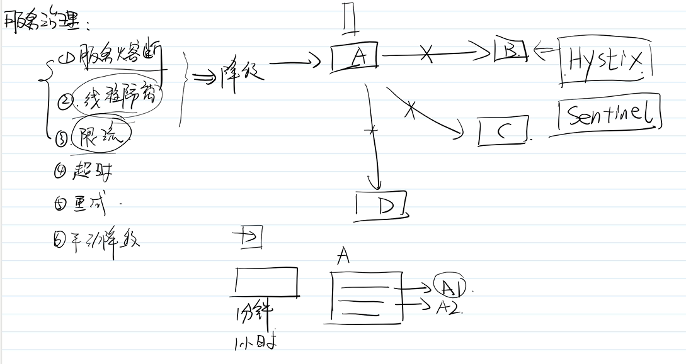
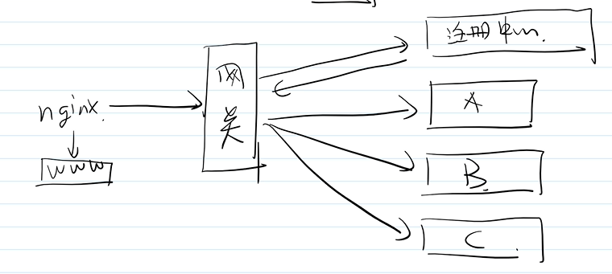
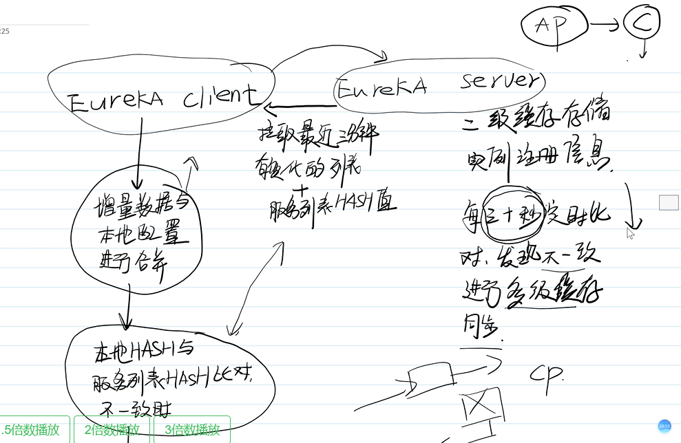
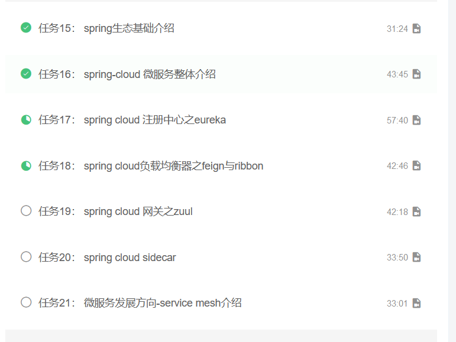

#### Spring




## 

#### 2、SpringCloud

##### 1）、注册中心实现方式：


①Zookeeper（CP）



②Eureka（AP）

③sonsul


##### 2)服务交互：

* 1、服务交互协议：

​	    ①HTTP

​	    ②RPC：效率比HTTP高，对于数据交互很频繁的时候可以用（比如Jstorm，spark）



* 2、服务交互客户端：

  ①Ribbon：类似JdbcTemplate工具类-->动态性服务请求

  ②Feign：类似于Mybatis->Mapper 限制性强，可维护高，开发建议用

##### 3）服务治理

①服务熔断

②线程隔离

③限流

④超时

⑤重试

⑥手动降级



* nginx 通过网关自动转化

  

* 网关：
  * zuul
  * spring cloud gateway（性能比zuul好）

##### 4）配置中心

#### 2、springCloud注册中心eureka

client配置服务器交互内容

instance配置实例类容（实例ip，实例名称）


eureka server和eurekacalient(失败)


```
fetch-registry: false
```







枚举类：后缀为ENUM

获取单个对象的方法用 `get` 做前缀。

获取多个对象的方法用 `list` 做前缀。

获取统计值的方法用 `count` 做前缀。

插入的方法用 `save/insert` 做前缀。

删除的方法用 `remove/delete` 做前缀。

修改的方法用 `update` 做前缀。


`if/for/while/switch/do` 等保留字与括号之间都必须加空格。

