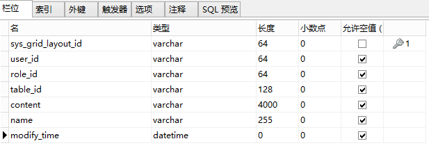
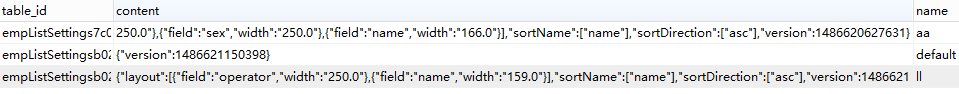
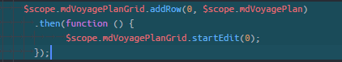
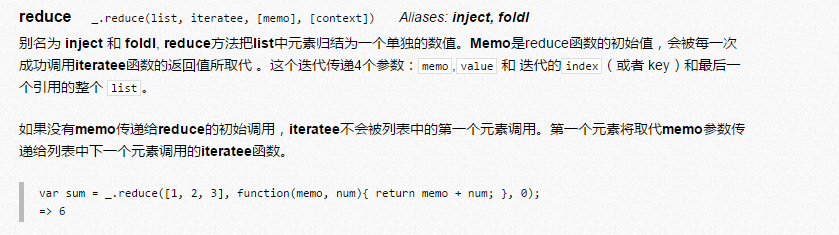

#### 开发新表格目的

主要是为了支持大数据量的渲染。比如一个表格有2万条数据，旧表格可能会挂掉，新表格的渲染做了优化。

新表格相关指令

| 指令名                                                       | 含义                                                   |
| ------------------------------------------------------------ | ------------------------------------------------------ |
| [g-hot-table](http://172.16.0.142/html/branch-stage#/widget/hotTable/g-hot-table) | 新表格指令，用法与旧表格相同                           |
| [g-hot-column](http://172.16.0.142/html/branch-stage#/widget/hotTable/g-hot-column) | 新表格列定义指令，用法与旧表格相同                     |
| [g-hot-checkbox-column](http://172.16.0.142/html/branch-stage#/widget/hotTable/g-hot-checkbox-column) | 新表格复选框列定义指令，实现多选功能，用法与旧表格相同 |
| [g-hot-index-column](http://172.16.0.142/html/branch-stage#/widget/hotTable/g-hot-index-column) | 新表格列配置序号，用法与旧表格相同                     |
| [g-hot-column-editor](http://172.16.0.142/html/branch-stage#/widget/hotTable/g-hot-column-editor) | 指令内定义列编辑的方式，用法与旧表格相同               |

新表格属性（g-hot-table）

| 参数名                                                       | 类型                                                         | 是否必须 | 说明                                                         |
| ------------------------------------------------------------ | ------------------------------------------------------------ | -------- | ------------------------------------------------------------ |
| [source-name](http://172.16.0.142/html/branch-stage#/widget/hotTable/source-name) | string                                                       | Y        | 数据源名称，保持不变                                         |
| [validator-name](http://172.16.0.142/html/branch-stage#/widget/hotTable/validator-name) | string                                                       | N        | 校验名称，保持不变                                           |
| [on-load-success](http://172.16.0.142/html/branch-stage#/widget/hotTable/on-load-success) | function(grid - 表格对象,$event - 事件对象,source - 表格数据集,physicalSource - 表格数据集) | N        | 表格数据加载成功事件                                         |
| [on-render](http://172.16.0.142/html/branch-stage#/widget/hotTable/on-render) | function(grid - 表格对象,source - 表格数据集)                | N        | 表格初始化后的回调事件，NOTE：此时表格尚无数据               |
| [css-class](http://172.16.0.142/html/branch-stage#/widget/hotTable/css-class) | express / function() / function(row:Row)                     | N        | 新表格样式属性，用法与旧表格 g-item-class 类似               |
| [stretch](http://172.16.0.142/html/branch-stage#/widget/hotTable/stretch) | String                                                       | N        | 新增属性，表格列宽度不足表格宽度时，如何处理空白部分(none, last, all) |
| [width, height](http://172.16.0.142/html/branch-stage#/widget/hotTable/width) | Number/String                                                | N        | 表格宽度及高度                                               |
| [on-row-click](http://172.16.0.142/html/branch-stage#/widget/hotTable/on-row-click) | function(grid - 表格对象,$event - 事件对象,record -  当前点击行数据对象,colIndex - 当前点击所在的列序号,rowIndex - 当前点击所在的行序号（不包含隐藏行）,field -  当前点击所在的列字段名称,physicalRow - 当前点击所在的行序号（包含隐藏行）) | N        | 鼠标单击行事件                                               |
| [on-row-dbclick](http://172.16.0.142/html/branch-stage#/widget/hotTable/on-row-dbclick) | function($event - 事件对象,grid - 表格对象,record -  当前点击行数据对象,colIndex - 当前点击所在的列序号,rowIndex - 当前点击所在的行序号（不包含隐藏行）,field -  当前点击所在的列字段名称,physicalRow - 当前点击所在的行序号（包含隐藏行）) | N        | 鼠标双击行事件                                               |
| [on-check](http://172.16.0.142/html/branch-stage#/widget/hotTable/on-check) | function(grid - 表格对象,source -  表格数据集（层次数据结构）,physicalSource - 表格数据集（扁平数据结构）,checked - 勾选状态,row -  勾选行,physicalRow - 行序号,record - 行数据对象) | N        | 切换行勾选状态事件                                           |
| [on-check-all](http://172.16.0.142/html/branch-stage#/widget/hotTable/on-check-all) | function(grid - 表格对象,$event - 事件对象,source - 表格数据集（层次数据结构）,physicalSource - 表格数据集（扁平数据结构）,checked - 全选状态) | N        | 切换全选选状态事件                                           |
| [col-settings-key](http://172.16.0.142/html/branch-stage#/widget/hotTable/col-settings-key) | String                                                       | N        | 页面布局名称，保持不变                                       |
| [tree-view](http://172.16.0.142/html/branch-stage#/widget/hotTable/tree-view) |                                                              | N        | 是否开启树装表格功能                                         |
| [group](http://172.16.0.142/html/branch-stage#/widget/hotTable/group) | Boolean                                                      | N        | 是否开启分组表格功能                                         |
| [drag-check](http://172.16.0.142/html/branch-stage#/widget/hotTable/drag-check) | Boolean                                                      | N        | 是否开启拖动勾选，保持不变                                   |
| [filters](http://172.16.0.142/html/branch-stage#/widget/hotTable/filters) |                                                              | N        | 是否启用下拉过滤功能                                         |
| [front-end-sort](http://172.16.0.142/html/branch-stage#/widget/hotTable/front-end-sort) | Boolean                                                      | N        | 是否使用前端排序方式，默认为请求后端进行排序                 |
| [front-end-group](http://172.16.0.142/html/branch-stage#/widget/hotTable/front-end-group) | Boolean                                                      | N        | 是否使用前端分组方式，默认为请求后端进行分组                 |
| [group-summary-func](http://172.16.0.142/html/branch-stage#/widget/hotTable/group-summary-func) | Boolean                                                      | N        | 分组合计方法                                                 |
| [validate-on-change-editing-row / validate-on-change-editing-cell](http://172.16.0.142/html/branch-stage#/widget/hotTable/validate-on-change-editing-row) |                                                              | N        | 新增属性，是否在切换编辑行/单元格时执行校验                  |

列定义属性（g-hot-column）

| 参数名                                                       | 类型          | 是否必须 | 说明                                        |
| ------------------------------------------------------------ | ------------- | -------- | ------------------------------------------- |
| [data](http://172.16.0.142/html/branch-stage#/widget/hotTable/data) | express       | N        | 列字段，支持 angular 过滤器表达式，保持不变 |
| [sortable](http://172.16.0.142/html/branch-stage#/widget/hotTable/sortable) | void          | N        | 是否可排序，保持不变                        |
| [width](http://172.16.0.142/html/branch-stage#/widget/hotTable/width) | Number/String | N        | 列宽度，保持不变                            |
| [g-hot-column-editor](http://172.16.0.142/html/branch-stage#/widget/hotTable/g-hot-column-editor) |               | N        | 指令内定义列编辑的方式                      |
| [align](http://172.16.0.142/html/branch-stage#/widget/hotTable/align) | string        | N        | 列对齐方式                                  |
| [required](http://172.16.0.142/html/branch-stage#/widget/hotTable/required) | Boolean       | N        | 是否必填字段，保持不变                      |
| [hidden](http://172.16.0.142/html/branch-stage#/widget/hotTable/hidden) | Boolean       | N        | 是否隐藏列，保持不变                        |
| [title](http://172.16.0.142/html/branch-stage#/widget/hotTable/hidden) | String        | N        | 列标题文字                                  |

复选框指令（g-hot-checkbox-column）

| 参数名                                                       | 类型          | 是否必须 | 说明     |
| ------------------------------------------------------------ | ------------- | -------- | -------- |
| [width](http://172.16.0.142/html/branch-stage#/widget/hotTable/width) | Number/String | N        | 宽度属性 |

列配置序号指令（g-hot-index-column）

表格对象方法（grid）

| 方法名                                                       | 使用方式                              | 说明                           |
| ------------------------------------------------------------ | ------------------------------------- | ------------------------------ |
| [getSelectedRow](http://172.16.0.142/html/branch-stage#/widget/hotTable/selected-row) | grid.getSelectedRow()                 | 用于获取选中行数据             |
| [getCheckedRows](http://172.16.0.142/html/branch-stage#/widget/hotTable/on-action) | grid.getCheckedRows()                 | 用于获取勾选数据集合           |
| [startEdit](http://172.16.0.142/html/branch-stage#/widget/hotTable/startEdit) | grid.startEdit(row, col)              | 开始编辑表格单元格             |
| [finishEdit](http://172.16.0.142/html/branch-stage#/widget/hotTable/startEdit) | grid.finishEdit(validateType)         | 结束编辑表格单元格             |
| [addRow](http://172.16.0.142/html/branch-stage#/widget/hotTable/addRow) | grid.addRow(row,newRecord)            | 新增行                         |
| [deleteRow](http://172.16.0.142/html/branch-stage#/widget/hotTable/addRow) | grid.deleteRow(physicalRow)           | 删除行                         |
| [validateCell](http://172.16.0.142/html/branch-stage#/widget/hotTable/validate) | grid.validateCell(physicalRow, field) | 校验某个单元格数据             |
| [validateRow](http://172.16.0.142/html/branch-stage#/widget/hotTable/validate) | grid.validateRow(physicalRow)         | 校验某行数据                   |
| [validateAddedAndModifiedRows](http://172.16.0.142/html/branch-stage#/widget/hotTable/validate) | grid.validateAddedAndModifiedRows()   | 校验所有新增行及修改行的数据   |
| [getCheckedLeafRows](http://172.16.0.142/html/branch-stage#/widget/hotTable/getCheckedLeafRows) | grid.getCheckedLeafRows()             | 获取分组表格的叶子节点数据集合 |
| [getCheckedGroupRows](http://172.16.0.142/html/branch-stage#/widget/hotTable/getCheckedGroupRows) | grid.getCheckedGroupRows()            | 获取分组表格的分组行数据集合   |


####  14、getSelectedRow

表格对象提供 getSelectedRow 方法用于选中行数据，值为对象类型，用法如下：

```html
<script>
 var TryControllerConstructor = function($scope){
            $scope.empGridSuccess = function (grid, source) {
                 $scope.gridInstance = grid;
            };

           $scope.consoleSelectedRow= function () {
                 console.log($scope.gridInstance.getSelectedRow());
            };
         }
</script>

<button type="button" ng-click="consoleSelectedRow()">打印激活行</button>

<g-hot-table data-source-name="employeeSource">
<g-hot-column data="name">姓名</g-hot-column>
<g-hot-column data="sex"> 性别</g-hot-column>
</g-hot-table>
```


#### 15、getCheckedRows

表格对象提供 getCheckedRows 方法用于勾选数据集合，值为数组类型，用法如下：

```html
<script>
 var TryControllerConstructor = function($scope){
            $scope.empGridSuccess = function (grid, source) {
                 $scope.gridInstance = grid;
            };

           $scope.consoleChectedRows= function () {
                 console.log($scope.gridInstance.getCheckedRows());
            };
         }
</script>

<button type="button" ng-click="consoleChectedRows()">打印复选行</button>

<g-hot-table data-source-name="employeeSource"
         on-load-success="empGridSuccess(grid, source)">
<g-hot-column data="name">姓名</g-hot-column>
<g-hot-column data="sex"> 性别</g-hot-column>
</g-hot-table>
```


#### 15、css-class

新表格行、列样式属性


为满足一定条件的新表格行、列添加样式

```html
<style>
    .bgRed{
        background-color: red;
        color:#ffffff;
    }
</style>

<script>
 var TryControllerConstructor = function($scope){
            $scope.rowClass = function (row) {
                return row.age == 60 ? "bgRed" : "";
            };
			$scope.colClass = function (row) {
                return row.age > 60 ? "bgRed" : "";
            };
         }
</script>

<g-hot-table data-source-name="employeeSource"
         css-class="rowClass(row)">
<g-hot-column data="name">姓名</g-hot-column>
<g-hot-column data="年龄" css-class="colClass(row)> 年龄</g-hot-column>
</g-hot-table>
```


#### 16、stretch

属性说明：新增属性，表格列宽度不足表格宽度时，如何处理空白部分，值为(none, last, all)，默认为none

* none：不做处理，按照实际宽度显示

* last：把多余的空白分配到最后一列

* all：把多余的空白平均分配到每一列

简单用例：表格列宽度不足表格宽度时，把多余的空白平均分配到每一列进行展示

```html
<g-hot-table data-source-name="employeeSource"
         stretch="all">
<g-hot-column data="name">姓名</g-hot-column>
<g-hot-column data="sex"> 性别</g-hot-column>
</g-hot-table>
```


#### 17、width, height

属性说明：宽度及高度

* width, height 用在g-hot-table 指令上代表表格整体宽度及高度

* width 用在 g-hot-checkbox-column 指令上代表表格复选框宽度

* width 用在 g-index-item 指令上代表表格序号列宽度，默认根据序号自适应宽度

* width 用在 g-hot-column 指令上代表表格列宽度

简单用例：为新表格设置宽度及高度

```html
<g-hot-table data-source-name="employeeSource"
         height="300"
         width="600">
<g-hot-checkbox-column width="50"></g-hot-checkbox-column>
<g-hot-column data="name" width="200">姓名</g-hot-column>
</g-hot-table>
```


#### 18、on-row-click, on-row-dbclick

属性说明：on-row-click：鼠标单击行事件；on-row-dbclick：鼠标双击行事件。参数包括：

* grid - 表格对象

* $event - 事件对象

* record - 当前点击行数据对象

* colIndex - 当前点击所在的列序号

* rowIndex - 当前点击所在的行序号（不包含隐藏行）

* field - 当前点击所在的列字段名称

* physicalRow - 当前点击所在的行序号（包含隐藏行）


简单用例：单击新表格行后进入编辑状态

```html
<script>
   var TryControllerConstructor = function($scope){
              $scope.empGridSuccess = function (grid, source) {
                  $scope.gridInstance = grid;
             };
             $scope.sexData = [{
                    name: '男',
                    value: 'Male'
                }, {
                    name: '女',
                    value: 'Female'
                }];
            $scope.onRowClick= function ($event, record ,grid, physicalRow, field) {
                console.log("打印行序号："+ physicalRow + "   列字段名称："+ field);
                console.log(record);
            };

            //双击进入编辑状态：grid.startEdit(physicalRow, field)
            $scope.onRowDbClick= function (physicalRow, field) {
                $scope.gridInstance.startEdit(physicalRow,field);
            };
    }
</script>
<g-hot-table data-source-name="employeeSource"
             on-load-success="empGridSuccess(grid, source)"
             on-row-click="onRowClick($event, record ,grid, physicalRow, field)"
             on-row-dbclick="onRowDbClick(physicalRow, field)"
    >
    <g-hot-column data="name" align="center" width="200" title="姓名">
        <g-hot-column-editor>
            <input type="text" name="name" ng-model="row.name">
            <input type="hidden" name="id" ng-model="row.id"/>
        </g-hot-column-editor>
    </g-hot-column>

    <g-hot-column data="sex | sexToCn" sortable width="150" title="性别">
        <g-hot-column-editor>
            <g-dropdown list-type="single"
                        placeholder="请选择"
                        source="sexData"
                        display-express="name"
                        value-prop="value"
                        name="sex"
                        ng-model="sex">
            </g-dropdown>
        </g-hot-column-editor>
    </g-hot-column>

    <g-hot-column data="email" width="200" title="Email">
        <g-hot-column-editor>
            <input type="email" ng-model="editingRecord.email" name="email">
        </g-hot-column-editor>
    </g-hot-column>
</g-hot-table>
```


#### 19、on-check，不太懂

属性说明：切换行勾选状态事件。参数包括：

* grid - 表格对象

* source - 表格数据集（层次数据结构）

* checked - 勾选状态，true或false

* row - 勾选行序号

* physicalRow - 勾选行序号，表格呈树形结构时的参数

* record - 行数据对象

简单用例：为新表格添加切换行勾选状态事件

```html
<script>
   var TryControllerConstructor = function($scope){
      $scope.onCheck= function (grid,source, checked,row,physicalRow,record) 
            {
                 console.log(row+"  "+physicalRow+ "  "+checked);
           }
    }
</script>
<g-hot-table ng-cloak data-source-name="employeeSource"
             on-check="onCheck(grid,source, checked,row,physicalRow,record)"
        >
    <g-hot-checkbox-column></g-hot-checkbox-column>
    <g-hot-column data="name" title="姓名"></g-hot-column>
    <g-hot-column data="age" title="年龄"></g-hot-column>
</g-hot-table>
```


#### 20、on-check-all

属性说明:切换全选状态事件。参数包括：

* grid - 表格对象

* $event - 事件对象

* source - 表格数据集（层次数据结构）

* physicalSource - 表格数据集（扁平数据结构），表格呈树形结构时的参数

* checked - 全选状态，true或false

简单用例:为新表格添加全选状态事件

```html
<script>
   var TryControllerConstructor = function($scope){
      $scope.onCheck= function (grid,$event,source,physicalSource,checked)
            {
                 console.log(checked);
                 console.log(source);
           }
    }
</script>
<g-hot-table ng-cloak data-source-name="employeeSource"
             on-check-all="onCheck(grid,$event,source,physicalSource,checked)"
        >
    <g-hot-checkbox-column></g-hot-checkbox-column>
    <g-hot-column data="name" title="姓名"></g-hot-column>
    <g-hot-column data="age" title="年龄"></g-hot-column>
</g-hot-table>
```


#### 21、col-settings-key

属性说明：表格布局属性，使用方式与旧表格一致。

点击表头设置图标，可为表格增加各种布局，并将布局信息保存至数据库中。改变布局动作如下：

- 可通过"自定义列表项"显示与隐藏表格列信息（限制全部字段进行隐藏，否则弹出错误提示信息：不允许隐藏所有列）
- 可通过"自定义列表项"对已显示列进行列顺序调整
- 可通过"自定义列表项"固定列数，用于固定表格列数，固定几列后，拖动表格横向滚动条，被固定的前几列不会随着滚动条左右移动
- 表格列设置可持久化并保存至数据库中，用于存储表格列操作信息
- 可通过拖动列虚线对列宽进行调整
- 可通过拖动表头对列位置进行调整
- 可通过点击表头字段左侧的上三角、下三角对内容进行排序，当同时对多列进行排序时可在按住键盘ctrl键同时鼠标点击排序三角图标
- 可通过点击表头字段右侧的下三角对值进行过滤筛选，可同时对多列进行过滤
- 当列上增加operateColumn属性后，该列位置固定不变，无法拖动且不能隐藏

布局使用介绍

表格多布局保存功能，即通过布局名称保存当前布局至数据库表中。可通过在表格头部右键完成如下操作：

- 新增布局：当表格列设置需要持久化后可新增布局并保存至数据库表中
- 删除布局：可通过布局名称从数据库表中删除相应布局
- 默认布局：表格可设置默认布局功能，即当前代码所对应的表格布局
- 保存布局：将设计好的布局保存至数据库表中
- 布局另存为：修改布局后可重命名并将布局保存至数据库表中
- 列宽自适应：根据表格内容、列标题、表格脚步内容的最大宽度自适应
- 清除筛选条件：清除掉每列的过滤筛选条件

保存布局表结构

表格多布局保存表名可在后端配置文件application.properties中自由设置，如：grid.layout.table=SYS_GRID_LAYOUT，即多布局保存表名为：SYS_GRID_LAYOUT，表结构和表内容如下

​                            


​                            

- sys_grid_layout_id：布局id。
- user_id：用户标识id。
- role_id：用户角色标识id。
- table_id：表唯一标识。
- content：表格布局内容。带有列名称、列宽度、列显示顺序、排序、版本号相关信息。
- name：布局名称，当同一张表布局名称命名相同时，后一个布局可覆盖前一个布局。
- modify_time：布局最后一次修改时间。

注：不同表格的列设置键名称必须唯一，不可重复命名。


简单用例：在html页面上使用表格列设置功能持久化表格布局结构

```html
<g-hot-table ng-cloak data-source-name="employeeSource"
             col-settings-key="empListSettingsKey">
    <g-hot-column data="" title="操作 operateColumn"></g-hot-column>
    <g-hot-column data="name" title="姓名"></g-hot-column>
    <g-hot-column data="age" title="年龄"></g-hot-column>
</g-hot-table>
```


#### 22、drag-check

属性说明：是否开启拖动勾选，与 g-hot-checkbox-column 复选框指令协同使用，用法与旧表格一样

简单用例：在html页面上使用拖动方式勾选复选框

```html
<g-hot-table ng-cloak data-source-name="employeeSource"
             drag-check="true"
        >
    <g-hot-checkbox-column></g-hot-checkbox-column>
    <g-hot-column data="name" title="姓名"></g-hot-column>
    <g-hot-column data="age" title="年龄"></g-hot-column>
</g-hot-table>
```


#### 23、filters

属性说明：

是否启用下拉过滤功能，true：启用；false：不启用，默认不启用。启用后，表格列头显示下拉小图标

点击下拉小图标，将弹出下拉面板，过滤方式既可以通过查找过滤；也可以通过手动勾选反选复选框过滤；下拉面板还为我们提供全选、清除当前列的过滤条件功能

当我们需要清除所有列的过滤条件时，可在表头上右键-》选择清除筛选条件进行清除

简单用例：在html页面上为表格启用下拉过滤功能

```html
<g-hot-table ng-cloak data-source-name="employeeSource"
             filters="true"
        >
    <g-hot-column data="name" title="姓名"></g-hot-column>
    <g-hot-column data="age" title="年龄"></g-hot-column>
</g-hot-table>
```


#### 24、on-after-filter

属性说明

表格下拉筛选事件，与filters属性一同使用

简单用例

在html页面上为表格下拉筛选增加事件

```html
  <script>
      var ctx = '';
      var basePath = '/gschool';
      var TryControllerConstructor = function($scope){
          $scope.afterFilterTest=function(grid, trimmedRows, physicalSource){
              console.log("-------------------------");
              console.log(trimmedRows);
          }
      }
  </script>

<g-hot-table ng-cloak data-source-name="employeeSource"
             filters="true"
             on-after-filter="afterFilterTest(grid, trimmedRows, physicalSource)"
        >
    <g-hot-column data="name" title="姓名"></g-hot-column>
    <g-hot-column data="age" title="年龄"></g-hot-column>
</g-hot-table>
```


#### 25、startEdit, finishEdit

方法说明

表格对象提供 startEdit, finishEdit 方法，分别用于表格单元格开始编辑、结束编辑功能，用法如下：

grid.startEdit(row, col)

row: 行序号

col: 列序号或列字段名称，如未设置，默认为该行的第一个可编辑列。


grid.finishEdit(validateType)

validateType: 结束编辑时执行校验的方式，‘row’ 校验整行，’cell’ 校验单元格。如须使用校验方式，须和validate-name一同使用，否则校验无效。


该方法为异步操作，返回 promise 对象（旧表格是结束编辑是同步操作，使用方式有区别），如需要在结束编辑后执行某些操作，请在 .then 方法中进行，如：

```
     grid.finishEdit()
    .then(function () {
        // 结束编辑后执行的操作...
    });
```

注：编辑完后可按【tab】键进入到下一个单元格；按【shift+tab】键进入上一个单元格；按向上键【↑】进入到上一行；按按向下键【↓】进入到下一行。

简单用例

在html页面上双击表格单元格进入编辑模式，点击按钮调用finishEdit方法结束编辑。

```html
<script>
    var ctx = '';
    var basePath = '/gschool';
    var TryControllerConstructor = function($scope){
        $scope.empGridSuccess = function (grid, source) {
            $scope.gridInstance = grid;
        };
        
        //双击单元格进入编辑模式
        $scope.onRowDbClick = function ($event, record ,grid, physicalRow, field) {
            $scope.gridInstance.startEdit(physicalRow,field);
        };

        //结束编辑
        $scope.finishEdit = function () {
            $scope.gridInstance.finishEdit("row").then(function(){
                console.log("结束编辑后执行的操作...");
            })
        };
    }
</script>

<button type="button" ng-click="finishEdit()">结束编辑</button>

<g-hot-table ng-cloak data-source-name="employeeSource"
              on-load-success="empGridSuccess(grid, source)"
              on-row-dbclick="onRowDbClick ($event, record ,grid, physicalRow, field)"
        >
    <g-hot-column data="name" title="姓名">
        <g-hot-column-editor>
            <input type="text" name="name" ng-model="row.name">
            <input type="hidden" name="id" ng-model="row.id"/>
        </g-hot-column-editor>
    </g-hot-column>
</g-hot-table>
```


#### 26、addRow, deleteRows

方法说明

表格对象提供 addRow 方法用于新增行，用法：grid.addRow(physicalRow,newRecord) ，参数介绍如下：

physicalRow - 新增行所在的行序号

newRecord - 新增行初始数据

此方法为异步操作，返回 promise 对象，如需要在新增行完成后执行某些操作，请在 .then 方法中进行。如下所示：



同时表格对象提供 deleteRow 方法用于删除行，用法：grid.deleteRow(physicalRow)

简单用例

在html页面上为表格新增行，并初始化该行内容，同时将鼠标定位至该行

```html
<script>
    var ctx = '';
    var basePath = '/gschool';
    var TryControllerConstructor = function($scope){
        $scope.empGridSuccess = function (grid, source) {
            $scope.gridInstance = grid;
        };

        //新增行，并初始化该行内容，新增行完成后执行某些操作，如使该行进入编辑模式
        $scope.addRow = function () {
                var newRecord = {
                    age: 10,
                    name: 'xxxxx',
                    email: 'xxxxx@xx.com'
                };
               
 //新增行，并初始化该行内容，新增行完成后执行某些操作，如使该行进入编辑模式           
        $scope.gridInstance.addRow(0,newRecord).then(function(){
                         $scope.gridInstance.startEdit(0,"name")
                 });;
            }

        // 删除第一条记录
        $scope.deleteRow = function () {
                $scope.gridInstance.deleteRows(0);
            };
    }
</script>

<button type="button" ng-click="addRow()">新增一行（鼠标定位）</button>
<button type="button" ng-click="deleteRow()">删除第一行</button>

<g-hot-table ng-cloak data-source-name="employeeSource"
              on-load-success="empGridSuccess(grid, source)"
        >
    <g-hot-column data="name" title="姓名">
        <g-hot-column-editor>
            <input type="text" name="name" ng-model="row.name">
            <input type="hidden" name="id" ng-model="row.id"/>
        </g-hot-column-editor>
    </g-hot-column>
</g-hot-table>
```


#### 27、validator-name

属性说明：

校验名称

简单用例

在html页面上为表格配置校验名称，对编辑中的单元格数据进行校验

```html
<script>
    var ctx = '';
    var basePath = '/gschool';
    var TryControllerConstructor = function($scope){
        $scope.empGridSuccess = function (grid, source) {
            $scope.gridInstance = grid;
        };

         $scope.finishEdit = function () {
               $scope.gridInstance.finishEdit("row").then(function(){
                // 获取表格是否校验通过的状态可使用表格对象的 isValid() 方法
                     console.log("是否校验通过  "+ $scope.gridInstance.isValid());
                  })
            };
    }
</script>

<button type="button" ng-click="finishEdit()">结束编辑并校验</button>

<g-hot-table ng-cloak data-source-name="employeeSource"
              on-load-success="empGridSuccess(grid, source)"
              on-row-dbclick="onRowDbClick ($event, record ,grid, physicalRow, field)"
              validator-name="Employee_Update"
        >
    <g-hot-column data="name" title="姓名">
        <g-hot-column-editor>
            <input type="text" name="name" ng-model="row.name">
            <input type="hidden" name="id" ng-model="row.id"/>
        </g-hot-column-editor>
    </g-hot-column>
</g-hot-table>
```


#### 28、validate-on-change-editing-cell、validate-on-change-editing-row

属性说明

新表格新增属性，是否在切换编辑行/单元格时执行校验

简单用例

在html页面上编辑表格数据，当切换行/单元格时执行校验

```html
<script>
    var ctx = '';
    var basePath = '/gschool';
    var TryControllerConstructor = function($scope){
        $scope.empGridSuccess = function (grid, source) {
            $scope.gridInstance = grid;
        };

       // 双击单元格进入编辑状态
       $scope.onRowDbClick = function ($event, record ,grid, physicalRow, field) {
            $scope.gridInstance.startEdit(physicalRow,field);
        };
    }
</script>

<g-hot-table ng-cloak data-source-name="employeeSource"
              on-load-success="empGridSuccess(grid, source)"
              validator-name="Employee_Update"
              validate-on-change-editing-row
        >
    <g-hot-column data="name" title="姓名">
        <g-hot-column-editor>
            <input type="text" name="name" ng-model="row.name">
            <input type="hidden" name="id" ng-model="row.id"/>
        </g-hot-column-editor>
    </g-hot-column>
</g-hot-table>
```


#### 29、validateCell,validateRow,validateAddedAndModifiedRows

属性说明

新表格提供校验单元格、校验行、校验所有新增及修改行的方法，可自行调用。

grid.validateCell(physicalRow, field) 校验某个单元格数据，physicalRow 为行序号，field 为列字段名称

grid.validateRow(physicalRow) 校验某行数据，physicalRow 为行序号

grid.validateAddedAndModifiedRows() 校验所有新增行及修改行的数据

以上校验方法都是异步操作，返回 promise 对象，如需在校验完成后执行某些操作，请在 .then/.catch/.finally 方法中进行。如：

```
grid.validateRow(0)
    .then(function () {
            // 校验通过后执行的操作...
        })
    .catch(function () {
            // 校验未通过后执行的操作...
        })
    .finally(function () {
            // 校验结束后执行的操作...
        });
```

简单用例

在html页面上编辑表格数据，当切换行/单元格时执行校验

```html
<script>
    var ctx = '';
    var basePath = '/gschool';
    var TryControllerConstructor = function($scope){
        $scope.empGridSuccess = function (grid, source) {
            $scope.gridInstance = grid;
        };

       // 双击单元格进入编辑状态
       $scope.onRowDbClick = function ($event, record ,grid, physicalRow, field) {
            $scope.gridInstance.startEdit(physicalRow,field);
        };
       // 校验第一行，列字段为name的属性
       $scope.validateCell= function () {
                      $scope.gridInstance.validateCell(0,"name").then(function(){
                            alert("校验通过！");
                            $scope.gridInstance.finishEdit();
                   }).catch(function () {
                           alert("校验未通过！");
                           return;
                  }).finally(function () {
                          alert("校验结束后执行的操作...");
          });
        };

          // 校验第一行
       $scope.validateRow= function () {
                       $scope.gridInstance.validateRow(0).then(function(){
                                  alert("校验通过！");
                                  $scope.gridInstance.finishEdit();
                        }).catch(function () {
                                alert("校验未通过！");
                               return;
                  });
        };

          // 校验所有新增或修改数据
       $scope.validateAddedAndModifiedRows= function () {
                   $scope.gridInstance.validateAddedAndModifiedRows().then(function () {
                    var records = $scope.gridInstance.getModifiedRecords();
                    console.log(records);
                    alert("校验通过！");
                    $scope.gridInstance.finishEdit();
                }).catch(function () {
                    // 校验未通过后执行的操作...
                      alert("校验未通过！");
                     return;
                 });
        };

       // 校验通过状态
       $scope.isValid= function () {
               var isValid =  $scope.gridInstance.isValid();
                alert(isValid);
        };
    }
</script>

<button type="button" ng-click="validateCell()">校验第一行列名称为姓名字段</button>
<button type="button" ng-click="validateRow()">校验第一行</button>
<button type="button" ng-click="validateAddedAndModifiedRows()">校验所有修改行</button>
<button type="button" ng-click="isValid()">校验通过状态</button>

<g-hot-table ng-cloak data-source-name="employeeSource"
              on-load-success="empGridSuccess(grid, source)"
              validator-name="Employee_Update"
        >
    <g-hot-column data="name" title="姓名">
        <g-hot-column-editor>
            <input type="text" name="name" ng-model="row.name">
            <input type="hidden" name="id" ng-model="row.id"/>
        </g-hot-column-editor>
    </g-hot-column>
</g-hot-table>
```


#### 30、tree-view

属性说明

是否开启树形表格功能，需要后端数据源支持

树形表格数据源结构分析

子数据挂在父数据的 __children 字段下

```html
{
    "symbol": "RESULT_SYMBOL",
    "data": {
    "pageSize": 10,
        "totalRecord": 37,
        "currentPage": 1,
        "totalPage": 3,
        "records": [
        {
            "id": "id-1",
            "name": "Bertha",
            "mobile": "18811633735",
            "telephone": "0592-6004558",
            "email": "Bertha@gmail.com",
            "age": 29,
            "birthDay": 1487551394682,
            "__children": null
        },
        {
            "id": "id-2",
            "name": "Bess",
            "mobile": "18481566406",
            "telephone": "0592-0990331",
            "email": "Bess@gmail.com",
            "age": 60,
            "birthDay": 1487551394684,
            "__children": [
                {
                    "id": "id-2-1",
                    "name": "ngela",
                    "mobile": "13976810559",
                    "telephone": "0592-7130311",
                    "email": "ngela@gmail.com",
                    "age": 61,
                    "birthDay": 1487551394685
                },{
                    "id": "id-2-2",
                    "name": "Astrid",
                    "mobile": "13976810559",
                    "telephone": "0592-7130311",
                    "email": "Astrid@gmail.com",
                    "age": 61,
                    "birthDay": 1487551394685
                }
            ]
        },
        {
            "id": "id-3",
            "name": "Lee",
            "mobile": "13976810559",
            "telephone": "0592-7130311",
            "email": "Lee@gmail.com",
            "age": 61,
            "__children": [
                {
                    "id": "id-3-1",
                    "name": "Lauren",
                    "mobile": "13976810559",
                    "telephone": "0592-7130311",
                    "email": "Lauren@gmail.com",
                    "age": 61,
                    "birthDay": 1487551394685,
                    "__children":[
                        {
                            "id": "id-3-1-1",
                            "name": "Jacqueline",
                            "mobile": "13976810559",
                            "telephone": "0592-7130311",
                            "email": "Jacqueline@gmail.com",
                            "age": 61,
                            "birthDay": 1487551394685
                        }
                    ]
                }
            ]
        }, ......
    ],
        "recordIndex": 0,
        "recordStart": 1,
        "recordEnd": 15
},
    "success": true
}
               
```


简单用例

在html页面上开启树形表格功能

```html
<g-hot-table ng-cloak data-source-name="employeeSource"
            tree-view="true">
    <g-hot-column data="name" title="姓名"></g-hot-column>
</g-hot-table>
```


#### 31、group

属性说明

是否开启分组表格功能，默认不开启

当开启分组功能时，可通过点击表头的设置图标对表格布局进行分组设置

简单用例

在html页面上为新表格开启分组表格功能

```html
<g-hot-table ng-cloak data-source-name="employeeSource"
            col-settings-key="empListSettingsKey"
            group="true">
    <g-hot-column data="name" title="姓名"></g-hot-column>
</g-hot-table>
```


#### 32、front-end-group

属性说明

是否使用前端分组方式，该方式仅针对当前页进行分组，默认情况下使用后端分组方式，它是请求后端所有数据后进行的排序方式。与group协同使用。

简单用例

在html页面上为新表格开启分组表格功能，并且为前端分组方式进行展示

```html
<g-hot-table ng-cloak data-source-name="employeeSource"
             col-settings-key="empListGroupSettingsKey"
             group="true"
             front-end-group="true">
    <g-hot-column data="name" title="姓名"></g-hot-column>
</g-hot-table>
```


#### 33、group-summary-func

方法说明

g-hot-table上增加group-summary-func方法，绑定scope中定义的合计方法，该方法仅用作前端分组，与front-end-group一同使用。

在js中定义该方法，可接参数childrenRecords为此分组下的所有数据集合，方法需要返回一个对象。

注：带中括号的参数是可选的。



简单用例

在html页面上为新表格开启分组表格功能，并使用合计方法，统计每组年龄合计值

```html
<script>
    var ctx = '';
    var basePath = '/gschool';
    var TryControllerConstructor = function($scope){
        $scope.groupCount = function(childrenRecords){
	    var ageSum = _.reduce(childrenRecords, function(memo, record){
		return memo + (record.age || 0);
	}, 0);

        return {
            age : ageSum
        };
    }
</script>

<g-hot-table ng-cloak data-source-name="employeeSource"
            group="true"
            group-summary-func="groupCount"
            >
    <g-hot-column data="name" title="姓名"></g-hot-column>
    <g-hot-column data="age" title="年龄"></g-hot-column>
</g-hot-table>
```


#### 34、getCheckedLeafRows

方法说明

表格对象提供 getCheckedLeafRows 方法用于获取分组表格的叶子节点数据集合

注：由于数据异步加载，只有数据集合被加载后才可获取到分组表格的叶子节点数据集合

简单用例

在表格控件中使用 getCheckedLeafRows()方法，当通过复选框勾选完子结点后，点击按钮将叶子节点数据集合打印至控制台

```html
<script>
    var ctx = '';
    var basePath = '/gschool';
    var TryControllerConstructor = function($scope){
        $scope.empGridSuccess = function (grid, source) {
                 $scope.gridInstance = grid;
            };

        $scope.consoleChectedLeafRows = function(){
              console.log($scope.gridInstance.getCheckedLeafRows());
          }
    }
</script>

<button type="button" ng-click="consoleChectedLeafRows()">打印叶子节点集合数据</button>

<g-hot-table ng-cloak data-source-name="employeeSource"
            on-load-success="empGridSuccess(grid, source)"
            col-settings-key="empListGroupSettingsKey"
            group="true"
            >
    <g-hot-column data="name" title="姓名"></g-hot-column>
    <g-hot-column data="age" title="年龄"></g-hot-column>
</g-hot-table>
```


#### 35、getCheckedGroupRows，不懂

方法说明

表格对象提供 getCheckedGroupRows 方法用于获取分组表格的分组行数据集合

注：由于数据异步加载，只有数据集合被加载时才可获取到分组行数据集合。

简单用例

在表格控件中使用 getCheckedGroupRows()方法，当通过复选框勾选完父结点后，点击按钮将分组表格的分组行数据集合打印至控制台

```html
<script>
    var ctx = '';
    var basePath = '/gschool';
    var TryControllerConstructor = function($scope){
        $scope.empGridSuccess = function (grid, source) {
                 $scope.gridInstance = grid;
            };

        $scope.consoleCheckedGroupRows = function(){
              console.log($scope.gridInstance.getCheckedGroupRows());
          }
    }
</script>

<button type="button" ng-click="consoleCheckedGroupRows()">打印分组行数据集合</button>

<g-hot-table ng-cloak data-source-name="employeeSource"
            on-load-success="empGridSuccess(grid, source)"
            col-settings-key="empListGroupSettingsKey"
            group="true"
            >
    <g-hot-column data="name" title="姓名"></g-hot-column>
    <g-hot-column data="age" title="年龄"></g-hot-column>
</g-hot-table>
```


#### 36、summary

属性说明

列统计功能，针对表格当前页进行合计。值有：'sum', 'min', 'max', 'count', 'average'

sum：合计

min：最小值

max：最大值

count：数量

average：平均值

简单用例

在新表格中使用列统计功能对当前页的年龄进行合计，合计后表格脚部显示一行合计栏

```html
<g-hot-table ng-cloak data-source-name="employeeSource"
            >
    <g-hot-column data="name" title="姓名"></g-hot-column>
    <g-hot-column data="age" title="年龄" summary="sum"></g-hot-column>
</g-hot-table>
```


#### 37、getVisibleFields,getColumnDropFilters

属性说明

表格对象提供getVisibleFields 和 getColumnDropFilters 方法获取当前页的表格布局，一般与导出结合使用。

getVisibleFields：获取当前布局中已显示的列信息

getColumnDropFilters：获取filters下拉过滤信息

简单用例

在新表格中使用getVisibleFields()和getColumnDropFilters()方法获取当前页的表格布局信息并与导出控件结合使用。

```html
<script>
    var TryControllerConstructor = function($scope) {
        $scope.empGridSuccess = function (grid) {
            $scope._dataGrid = grid;
        };
        $scope.exportGridData = function () {
            exportField = $scope._dataGrid.getVisibleFields();
            columnDropFilter = $scope._dataGrid.getColumnDropFilters();
        }
    }        
</script>

<button ng-click="exportGridData()" class="btn btn-default">同步导出表格当前页布局</button>

<g-hot-table ng-cloak data-source-name="employeeSource"
             data-on-load-success="empGridSuccess(grid)"
             col-settings-key="empListSettingsKey"
             filters="true" >
    <g-hot-column data="name" title="姓名"></g-hot-column>
    <g-hot-column data="age" title="年龄"></g-hot-column>
</g-hot-table>
```


#### 38、[getAddedAndModifedRecords](http://172.16.0.142/html/branch-stage#/widget/hotTable/getAddedAndModifedRecords?courseId=2e8c206d-8f6b-4661-b7c2-5f080a7f865b&stageId=50)

方法说明

表格对象提供方法获取修改保存数据信息

getModifiedRecords：获取修改过的数据集合

getModifiedRecordMap：获取修改过的数据 Map

getAddedRecords：获取新增数据集合

getAddedRecordMap：获取新增数据 Map

getAddedAndModifedRecords：获取新增及修改数据集合

getAddedAndModifedRecordMap：获取新增及修改数据 Map

clearModifedInfo：清除数据修改信息

简单用例

在新表格中编辑数据，通过表格对象grid提供的方法获取新增、修改过的数据集合。

```html
<script>
    var TryControllerConstructor = function($scope) {
        $scope.empGridSuccess = function (grid) {
             $scope._dataGrid = grid;
        };

        $scope.onRowDbClick= function (physicalRow, field) {
            $scope.gridInstance.startEdit(physicalRow,field);
        };
        //获取新增、修改过的数据集合
        $scope.consoleAddedAndModifedRecords= function () {
            console.log( $scope.gridInstance.getAddedAndModifedRecords());
        }
    }        
</script>

<button type="button" ng-click="consoleAddedAndModifedRecords()">获取新增及修改数据集合</button>

<g-hot-table ng-cloak data-source-name="employeeSource"
             data-on-load-success="empGridSuccess(grid)"
             on-row-dbclick="onRowDbClick(physicalRow, field)" >
    <g-hot-column data="name" title="姓名"></g-hot-column>
    <g-hot-column data="age" title="年龄"></g-hot-column>
</g-hot-table>
```


#### 39、transformColumns

方法说明

新增动态列接口，开发人员可根据需求调用此接口来变更展示的列信息

简单用例

在新表格中变更展示表格的列信息。

```html
<script>
    var TryControllerConstructor = function($scope) {
        $scope.empGridSuccess = function (grid) {
             $scope._dataGrid = grid;
        };

        $scope.transformColumns= function () {
            $scope.gridInstance. transformColumns([
                           { field: "name", show:true, title:"姓名" },
                           { field: "telephone", show:false},
                           { field: "age", show:true}
                     ]);
            //重新reload后方可显示更新后的列信息
            $scope._dataGrid.reload();
        };
    }
</script>

<button type="button" ng-click="transformColumns()">变更列信息</button>

<g-hot-table ng-cloak data-source-name="employeeSource"
             data-on-load-success="empGridSuccess(grid)"
           >
    <g-hot-column data="name" title="姓名"></g-hot-column>
    <g-hot-column data="age" title="年龄"></g-hot-column>
</g-hot-table>
```


#### 40、on-after-select

属性说明

新表格单元格定位事件（包括鼠标点击单元格、键盘上下左右键移动、tab键移动）

简单用例

在html页面上按键盘上下左右键触发该事件

```html
  <script>
      var ctx = '';
      var basePath = '/gschool';
      var TryControllerConstructor = function($scope){
          $scope.onAfterSelect=function(grid,record,row,col){
               console.log("表格单元格定位");
           }
      }
  </script>

<g-hot-table ng-cloak data-source-name="employeeSource"
             filters="true"
             on-after-select="onAfterSelect(grid,record,row,col)"
        >
    <g-hot-column data="name" title="姓名"></g-hot-column>
    <g-hot-column data="age" title="年龄"></g-hot-column>
</g-hot-table>
```


#### 41、on-before-column-sort

属性说明

新表格排序前触发事件

简单用例

在新表格中点击排序小图标，触发排序事件

```html
  <script>
      var ctx = '';
      var basePath = '/gschool';
      var TryControllerConstructor = function($scope){
          $scope.onBeforeColumnSort=function(grid,col,sortName,sortDirection){
                console.log(sortName+"->"+sortDirection);
           }
      }
  </script>

<g-hot-table ng-cloak data-source-name="employeeSource"
             filters="true"
             on-before-column-sort="onBeforeColumnSort(grid,col,sortName,sortDirection)"
        >
    <g-hot-column data="name" title="姓名"></g-hot-column>
    <g-hot-column data="age" title="年龄"></g-hot-column>
</g-hot-table>
```

#### 42、nls

属性说明

新表格国际化支持

简单用例

新表格国际化支持，当nls选择韩文字典时，将表格对应的内容转换为韩文

```html
  <script>
      var ctx = '';
      var basePath = '/gschool';
      var TryControllerConstructor = function($scope){
           //国语字典
            $scope.Chinese={
                "name":"@ 姓名",
                "age":"@ 年龄",
                "sex":"@ 性别"
           }
            //韩语字典
             $scope.korean={
                    "name":"성명",
                    "age":"나이, 나이",
                    "sex":"성별."
              }
      }
  </script>

<g-hot-table ng-cloak data-source-name="employeeSource"
                nls="korean"
        >
    <g-hot-column data="name" title="nls.name"></g-hot-column>
    <g-hot-column data="age" title="nls.age"></g-hot-column>
</g-hot-table>
```