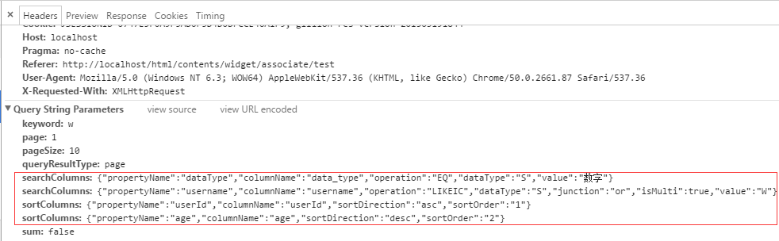

联想控件

控件简介

该控件用于将某一数据源以下拉列表的形式展示出来，选项信息可通过输入关键字或下拉形式选择。

该控件除了使用鼠标单击选中选项外，也可使用键盘上下键移动选项进行选择，单选时：通过空格键（space）和回车键（enter）选中并关闭；多选时：通过空格键（space）选中但不关闭或者回车键（enter）选中并关闭。

- 主指令（g-associate）：用于定义联想控件
- 子指令（g-associate-column）：用于设置表格头部字段名称和过滤器
- 关联指令（g-data-bind）：用于设置与联想控件已勾选显示的对应字段 

注1：当数据源多于10条数据时，联想控件将自动显示分页效果

注2：联想输入框回车后默认可选中第一行数据

注3：多选情况下，联想控件筛选时按分隔符可自动选中第一行数据，默认分隔符为`,`

注4：精确匹配记录时按Tab键选中

注5：精确匹配记录时移开焦点选中（目前只支持单选）

属性列表（主指令：g-associate）

| 属性                                                         | 描述                                                         |
| ------------------------------------------------------------ | ------------------------------------------------------------ |
| [multi](http://172.16.0.142/html/branch-stage#/widget/associate/multi) | boolean类型，设置搜索结果是否可多选，true：多选；false：单选。默认为false |
| [source-name](http://172.16.0.142/html/branch-stage#/widget/associate/source-name) | 数据源名称，跟g-data-source指令对应                          |
| [value-separator](http://172.16.0.142/html/branch-stage#/widget/associate/value-separator) | 多条数据分隔符，默认为','                                    |
| [keyword-prop](http://172.16.0.142/html/branch-stage#/widget/associate/keyword-prop) | 关键词的名称，即发送到后台的请求参数名，默认值'keyword'      |
| [char-length-search](http://172.16.0.142/html/branch-stage#/widget/associate/empty-search) | 设置当关键词发起请求时的最短长度，默认为1                    |
| [delay-time](http://172.16.0.142/html/branch-stage#/widget/associate/delay-time) | 输入时请求延迟，默认是300ms                                  |
| [display-express](http://172.16.0.142/html/branch-stage#/widget/associate/display-express) | 数据源中的显示字段                                           |
| [value-prop](http://172.16.0.142/html/branch-stage#/widget/associate/value-prop) | 数据源中的隐藏字段                                           |
| [selected-row](http://172.16.0.142/html/branch-stage#/widget/associate/selected-row) | 联想控件必填属性，数组类型，已选行数据                       |
| [width](http://172.16.0.142/html/branch-stage#/widget/associate/width) | 设置联想控件及其子指令的的宽度，单位有%：百分比；in：英寸；cm：厘米；mm：毫米；pt：磅数；pc：12点活字；ex：字母高度的一半；em：字体高度；px：像素(默认) |
| [on-select](http://172.16.0.142/html/branch-stage#/widget/associate/on-select) | 选择时触发的事件                                             |
| [on-before-select](http://172.16.0.142/html/branch-stage#/widget/associate/on-before-select) | 选择前触发的事件，返回false则取消选择                        |
| [display-init](http://172.16.0.142/html/branch-stage#/widget/associate/display-init) | 回显需要设置的字符串，与ng-model的值一一对应                 |
| [unmatch-remove](http://172.16.0.142/html/branch-stage#/widget/associate/unmatch-remove) | 输入框中手动输入值，光标移开后，若输入值不合格，则系统是否自动清除掉手动输入的值。true：清除；false：保留（默认值） |
| [show-event](http://172.16.0.142/html/branch-stage#/widget/associate/show-event) | 显示联想下拉框事件，值可为jquery事件。如：鼠标点击元素click事件、鼠标双击元素dbclick事件、聚焦focus事件，默认为focus事件 |
| [prevent-tabindex](http://172.16.0.142/html/branch-stage#/widget/associate/prevent-tabindex) | 在联想控件中按回车键是否能跳到下一个输入框，true不可以，false可以 |
| [g-focus-select](http://172.16.0.142/html/branch-stage#/widget/associate/g-focus-select) | 鼠标点击输入框全选功能                                       |

子指令：g-associate-column

| 属性                                                         | 描述                                                         |
| ------------------------------------------------------------ | ------------------------------------------------------------ |
| [width](http://172.16.0.142/html/branch-stage#/widget/associate/width) | 表格列宽度，单位有%：百分比；in：英寸；cm：厘米；mm：毫米；pt：磅数；pc：12点活字；ex：字母高度的一半；em：字体高度；px：像素(默认) |
| [display-express](http://172.16.0.142/html/branch-stage#/widget/associate/display-express) | 对应字段名称                                                 |
| [filter-name](http://172.16.0.142/html/branch-stage#/widget/associate/filter-name) | 过滤器名称，多个用'\|'隔开                                   |
| [is-show](http://172.16.0.142/html/branch-stage#/widget/associate/is-show) | 是否显示联想控件头部字段名称                                 |

关联指令： g-data-bind 

| 属性                                                         | 描述                                                         |
| ------------------------------------------------------------ | ------------------------------------------------------------ |
| [g-data-bind](http://172.16.0.142/html/branch-stage#/widget/associate/g-data-bind) | 联想控件的关联指令，用于设置与联想控件已勾选显示的对应字段（应与联想控件selected-row属性对应） |
| [value-prop](http://172.16.0.142/html/branch-stage#/widget/associate/value-prop) | 对应字段名称                                                 |
| [ value-separator](http://172.16.0.142/html/branch-stage#/widget/associate/value-separator) | 多条数据分隔符，默认为','                                    |
| [multi](http://172.16.0.142/html/branch-stage#/widget/associate/multi) | boolean类型，设置搜索结果是否可多选，true：多选；false：单选。默认为false（注：当联想控件处于多选状态时，关联指令必须同步设置multi="true"） |
| [ng-model](http://172.16.0.142/html/branch-stage#/widget/associate/ng-model) | 用于绑定关联指令的值（即绑定value-prop字段的值）             |


#### 1、multi

属性说明

boolean类型，设置搜索结果是否可多选，true：多选；false：单选。默认为false（注：当联想控件处于多选状态时，关联指令必须同步设置multi="true"）

单选时：通过空格键(space)和回车键（enter）选中并关闭

多选时：通过空格键(space)选中但不关闭或者回车键（enter）选中并关闭

简单用例

该控件不是公共模块需要手动引入framework/associate/GillionAssociateModule联想控件模块

在html页面中分别设置multi属性的值为true/false，使得搜索结果为多选/单选类型

```html
    多选：<g-associate ng-cloak data-source-name="source1" keyword-prop="keyword"
    selected-row="selectedRow2"  display-express="username" multi="true">
    单选：<g-associate ng-cloak data-source-name="source1" keyword-prop="keyword"
    selected-row="selectedRow1"  display-express="username" multi="false">
```


#### 2、keyword-prop

属性说明

关键词的名称，即发送到后台的请求参数名，默认值'keyword'

简单用例

该控件不是公共模块需要手动引入framework/associate/GillionAssociateModule联想控件模块

通过搜索关键词自动检索出结果，请求参数名为"keyword"

```html
<g-associate ng-cloak data-source-name="source1"  multi="true"  ng-model="display"
  display-express="username"  keyword-prop="keyword">
 <g-associate-column width="60%" display-express="userId" >客户编号</g-associate-column>
 <g-associate-column width="20%" display-express="username" >用户名</g-associate-column>
 <g-associate-column display-express="password" >密码</g-associate-column>
</g-associate>
```


#### 3、display-express

属性说明

数据源中的显示字段

主指令g-associate中：用于联想选中后显示的字段

子指令g-associate-column中：用于联想时显示的列字段信息

简单用例

该控件不是公共模块需要手动引入framework/associate/GillionAssociateModule联想控件模块

在联想控件中显示数据源中的用户名，隐藏数据源中的客户编号

```html
<g-associate ng-cloak data-source-name="source1" display-express="username" >
  <g-associate-column  display-express="userId" >客户编号</g-associate-column>
  <g-associate-column  display-express="username" >用户名</g-associate-column>
  <g-associate-column display-express="password" >密码</g-associate-column>
</g-associate>
```


#### 4、char-length-search

属性说明

当关键词发起请求时的最短长度，默认长度为0（即鼠标单击联想输入框后开始向后台发送请求） 

简单用例

该控件不是公共模块需要手动引入framework/associate/GillionAssociateModule联想控件模块

在联想控件中设置输入关键字最短长度为3个字母时才向后台发送请求

```html
<g-associate data-source-name="source1" keyword-prop="keyword" display-express="username" char-length-search="3">
    <g-associate-column width="60%" display-express="userId" >客户编号</g-associate-column>
    <g-associate-column width="20%" display-express="username" >用户名</g-associate-column>
    <g-associate-column display-express="password" >密码</g-associate-column>
</g-associate>
```


#### 4、delay-time

​          

属性说明

输入时请求延迟，默认是300ms

简单用例

该控件不是公共模块需要手动引入framework/associate/GillionAssociateModule联想控件模块

在html页面中通过delay-time属性设置输入条件请求延迟时间3s，默认值300ms

```html
<g-associate ng-cloak data-source-name="source1" keyword-prop="keyword"  multi="true"
  ng-model="display" display-express="username" delay-time="3000" >
    <g-associate-column width="60%" display-express="userId" >客户编号</g-associate-column>
    <g-associate-column width="20%" display-express="username" >用户名</g-associate-column>
    <g-associate-column display-express="password" >密码</g-associate-column>
</g-associate>
```


#### 5、g-data-bind

属性说明

联想控件的关联指令，用于设置与联想控件已勾选显示的对应字段（应与联想控件selected-row属性对应）

简单用例

该控件不是公共模块需要手动引入framework/associate/GillionAssociateModule联想控件模块

在html页面中联想控件的selected-row属性的值和其关联指令g-data-bind属性的值相对应，从而达到数据同步的效果

```html
 <g-associate ng-cloak data-source-name="source1" keyword-prop="keyword"
 selected-row="selectedRow2" multi="true" ng-model="display" display-express="username">
     <g-associate-column width="60%" display-express="userId" >客户编号</g-associate-column>
     <g-associate-column width="20%" display-express="username" >用户名</g-associate-column>
     <g-associate-column display-express="password" >密码</g-associate-column>
 </g-associate>

 绑定username:<input g-data-bind="selectedRow2" multi="true" value-prop="username" ng-model="other2"/>
 <input ng-model="other2">
```


#### 6、filter-name

属性说明

过滤器名称，既可用'|'表示，也可用filter-name表示，现只支持单个过滤器

自定义过滤器

AngularJS 过滤器可用于转换数据，以下是常用的AngularJS 过滤器

| 过滤器    | 描述                     |
| --------- | ------------------------ |
| currency  | 格式化数字为货币格式。   |
| filter    | 从数组项中选择一个子集。 |
| lowercase | 格式化字符串为小写。     |
| orderBy   | 根据某个表达式排列数组。 |
| uppercase | 格式化字符串为大写。     |


除了AngularJS提供的过滤器之外我们也可以自定义过滤器，以下是对性别进行转换的过滤器示例

```javascript
var app = angular.module('myApp', []);
app.filter('sexToCn', function() { //可以注入依赖
    return function(sex) {
        if (sex === "1") {
                return "女";
            }
            if (sex === "0") {
                return "男";
            }
    }
});
```

简单用例

该控件不是公共模块需要手动引入framework/associate/GillionAssociateModule联想控件模块

使用过滤器将用户名、密码的字母转换成大写、性别转换成男或女显示

```html
<g-associate ng-cloak data-source-name="source1" keyword-prop="keyword" display-express="username">
    <g-associate-column display-express="userId" >客户编号</g-associate-column>
    <g-associate-column display-express="username" filter-name="uppercase">用户名</g-associate-column>
    <g-associate-column display-express="password|uppercase">密码</g-associate-column>
    <g-associate-column display-express="password" filter-name="sexToCn">性别</g-associate-column>
</g-associate>
```


#### 7、selected-row

属性说明

数组类型，已选行数据，为必填属性。

简单用例

该控件不是公共模块需要手动引入framework/associate/GillionAssociateModule联想控件模块

在html页面上通过 selected-row 获取联想控件的选中行数据，并通过关联指令绑定其行对象且以 ',' 形式在关联指令文本框中显示密码信息

```html
绑定password:<input g-data-bind="selectedRow" value-prop="password" multi="true" ng-model="other5"/>

<g-associate ng-cloak data-source-name="source1" keyword-prop="keyword" multi="true"
           ng-model="display" display-express="username" selected-row="selectedRow">
    <g-associate-column width="60%" display-express="userId" >客户编号</g-associate-column>
    <g-associate-column width="20%" display-express="username" >用户名</g-associate-column>
    <g-associate-column display-express="password" >密码</g-associate-column>
</g-associate>
```

#### 8、source-name

属性说明

数据源名称，跟g-data-source指令值对应

注：当数据源多于10条数据时，联想控件将自动显示分页效果

简单用例

该控件不是公共模块需要手动引入framework/associate/GillionAssociateModule联想控件模块

在联想控件中使用source-name属性与数据源名称对应，从而从数据源中提取数据信息。当数据源多于10条数据时，联想控件将自动显示分页效果

```html
<g-data-source
        url="/gschool/system/users/getPage"
        page-size="10"
        current-page="1"
        records-prop="data.records"
        total-page-field = "data.totalPage"
        data-params="testParams"
        data-source-name="source1"
        total-record-prop="data.totalRecord"
        current-page-param="page"
        allow-auto-load = "true"
        page="true">
</g-data-source>

<g-associate data-source-name="source1" display-express="username" ng-cloak>
   <g-associate-column display-express="username" >用户名</g-associate-column>
   <g-associate-column display-express="password" >密码</g-associate-column>
</g-associate>
```


#### 9、g-associate-column

属性说明

用于设置表格头部字段名称和过滤器

简单用例

该控件不是公共模块需要手动引入framework/associate/GillionAssociateModule联想控件模块

在联想控件的子指令中使用g-associate-column设置表格头部字段名称和过滤器

```html
<g-associate multi="true" data-source-name="source1" ng-model="display" display-express="username" ng-cloak>
    <g-associate-column  display-express="userId" filter-name="uppercase|uppercase">客户编号</g-associate-column>
    <g-associate-column  display-express="username" >用户名</g-associate-column>
    <g-associate-column display-express="password" filter-name="uppercase">密码</g-associate-column>
</g-associate>
```


#### 10、value-separator

属性说明

多条数据分隔符，默认为','

使用范围：联想控件以及关联指令中使用

注：联想输入框中输入分隔符后默认可选中第一行数据，并在数据末端自动带上分隔符，然后继续输入内容，继续联想

简单用例

该控件不是公共模块需要手动引入framework/associate/GillionAssociateModule联想控件模块

在联想控件以及关联指令中分别设置value-separator=';'和value-separator=':'，使得选择的多条数据分别以';'和‘:'分隔开， 默认值为','

```html
<input g-data-bind="selectedRow5" value-prop="password" multi="true" ng-model="other2" value-separator=':'/>
<g-associate ng-cloak data-source-name="source1"  multi="true" ng-model="display"
             display-express="username" selected-row="selectedRow5" value-separator=";" >
    <g-associate-column width="60%" display-express="userId" >客户编号</g-associate-column>
    <g-associate-column width="20%" display-express="username" >用户名</g-associate-column>
    <g-associate-column display-express="password" >密码</g-associate-column>
</g-associate>
```

#### 11、on-select

属性说明

选择时触发的事件

简单用例

该控件不是公共模块需要手动引入framework/associate/GillionAssociateModule联想控件模块

在联想控件中选择时触发事件

```html
 <script>
     var TryControllerConstructor = function($scope){
         $scope.aaa = function(){
             console.log("ng-change or on-select");
         }
     }
 </script>     
<g-associate ng-cloak data-source-name="source1" keyword-prop="keyword"
    display-express="username" on-select="aaa()">
 <g-associate-column display-express="username">用户名</g-associate-column>
 <g-associate-column display-express="password">密码</g-associate-column>
</g-associate>
```


#### 12、on-before-select

属性说明

选择前触发的事件，返回false则取消选择

简单用例

该控件不是公共模块需要手动引入framework/associate/GillionAssociateModule联想控件模块

在联想控件中选择前触发事件，返回false则取消选择

```html
 <script>
     var TryControllerConstructor = function($scope){
         $scope.bbb = function(){
             return false;
         }
     }
 </script>     
<g-associate ng-cloak data-source-name="source1" keyword-prop="keyword"
    display-express="username" on-before-select="bbb()">
 <g-associate-column display-express="username">用户名</g-associate-column>
 <g-associate-column display-express="password">密码</g-associate-column>
</g-associate>
```

#### 13、display-init

属性说明

为联想控件赋初始值，回显需要设置的字符串，与ng-model的值一一对应。

display-init：用于显示联想控件的值

ng-model：用于绑定联想控件提交的值

简单用例

该控件不是公共模块需要手动引入framework/associate/GillionAssociateModule联想控件模块

在联想控件中定义回显需要设置的字符串

```html
 <script>
     var TryControllerConstructor = function($scope){
         $scope.displayMulti = "test1,test2,test3";
         $scope.displayInitMulti = "test111,test222,test333";
     }
 </script>

     <input type="text" style="width: 100%" ng-model="displayMulti"/>
<g-associate g-associate ng-cloak data-source-name="source1" keyword-prop="keyword"
       selected-row="selectedRow5" multi="true" display-express="username"
       value-prop="userId" display-init="displayInitMulti" ng-model="displayMulti">
 <g-associate-column display-express="username">用户名</g-associate-column>
 <g-associate-column display-express="password">密码</g-associate-column>
</g-associate>
```

#### 14、is-show

属性说明

是否显示联想控件头部字段名称

true：显示联想控件头部字段名称（默认值）

false：隐藏联想控件头部字段名称

简单用例

该控件不是公共模块需要手动引入framework/associate/GillionAssociateModule联想控件模块

在联想控件中隐藏联想控件头部字段名称

```html
<g-associate g-associate ng-cloak
                data-source-name="source1"
                keyword-prop="keyword"
                display-express="username"
                value-prop="userId"
                is-show="false"
                >
  <g-associate-column display-express="username">用户名</g-associate-column>
</g-associate>
```


#### 15、unmatch-remove

属性说明

输入框中手动输入值，光标移开后，若输入值不合格，则系统是否自动清除掉手动输入的值。true：清除；false：保留（默认值）

简单用例

该控件不是公共模块需要手动引入framework/associate/GillionAssociateModule联想控件模块

在HTML页面上手动输入值，光标移开后，若输入值不合格，则系统能自动清除掉手动输入的值

```html
<g-associate g-associate ng-cloak
                data-source-name="source1"
                keyword-prop="keyword"
                display-express="username"
                value-prop="userId"
                unmatch-remove="true"
                >
  <g-associate-column display-express="username">用户名</g-associate-column>
</g-associate>
```


#### 16、show-event

属性说明

显示联想下拉框事件，值可为jquery事件。如：鼠标点击元素click事件、鼠标双击元素dblclick事件、聚焦focus事件，默认为focus事件。

注：当增加全局配置时优先级比控件上的设置要高。controls: {associate: {showEvent: 'dblclick'}}，

简单用例

该控件不是公共模块需要手动引入framework/associate/GillionAssociateModule联想控件模块

在HTML页面上设置鼠标双击显示联想下拉框

```html
<g-associate g-associate ng-cloak
                data-source-name="source1"
                keyword-prop="keyword"
                display-express="username"
                value-prop="userId"
                show-event="dblclick"
                >
  <g-associate-column display-express="username">用户名</g-associate-column>
</g-associate>
```


#### 17、prevent-tabindex

属性说明

在联想控件中按回车键是否阻止跳到下一个输入框，true阻止；false不阻止；默认阻止。使用方式有2种：

\1. 在控件中配置

\2. 在config.properties.js中全局配置 controls: {associate: {preventTabindex: true}}，

注：如果两者均有配置，控件上的优先级高于全局配置

简单用例

该控件不是公共模块需要手动引入framework/associate/GillionAssociateModule联想控件模块

在HTML页面上设置联想控件按回车键不会跳到下一个输入框

```html
<div g-tabindex>
<g-associate g-associate ng-cloak
                data-source-name="source1"
                keyword-prop="keyword"
                display-express="username"
                value-prop="userId"
                prevent-tabindex="true"
                >
  <g-associate-column display-express="username">用户名</g-associate-column>
</g-associate>
</div>
```

#### 18、receiver

属性说明

动态设置联想控件表头名称

简单用例

该控件不是公共模块需要手动引入framework/associate/GillionAssociateModule联想控件模块

在HTML页面上设置动态设置联想控件表头

```html
<script>
     var TryControllerConstructor = function($scope){
         $scope.test = function(){
             username: '用户名',
             pass: '密码',
             testFunc: function(str) {
                return '#' + str + '#';
            }
         }
     }
 </script>

<div g-tabindex>
<g-associate g-associate ng-cloak
                data-source-name="source1"
                keyword-prop="keyword"
                display-express="username"
                value-prop="userId"
                receiver="test"
                >
  <g-associate-column display-express="userId">{ {receiver.testFunc(1+1)} }</g-associate-column>
  <g-associate-column display-express="username">{ {receiver.username} }</g-associate-column>
  <g-associate-column display-express="password">{ {receiver.pass} }</g-associate-column>
</g-associate>
</div>
```


#### 19、列配置提取

属性说明

联想控件，列配置提取功能，将联想控件列信息、条件信息、排序信息提取出来存于js文件中，页面通过key值引入

简单用例

该控件不是公共模块需要手动引入framework/associate/GillionAssociateModule联想控件模块，以及需要引入列配置文件信息

1.列配置文件（elementShlpSetting.js）模板如下：

```java
if(window.ASSOCIATE_CONSTANT===undefined) window.ASSOCIATE_CONSTANT = {};
window.ASSOCIATE_CONSTANT = {
    elementShlpSetting:{
        columns:[
            //列信息
            {displayExpress:"userId",width:"200px",text:"客户编号"},
            {displayExpress:"username", filterName:"uppercase", width:"100px",text:"用户名"},
            {displayExpress:"password",width:"100px",text:"密码"}
        ],
        conditions: [
            //固定值结构
            {propertyName:"dataType",columnName:"data_type",dataType:"S",value:"数字",operation:"EQ"},
            //动态变量结构
            {propertyName:"creator",columnName:"creator",dataType:"S", express: "$sessionAttrs.loginUser.username",
              express_type:"global", junction:"and",operation:"EQ"},
            //单选、多选结构
            {propertyName:"username",columnName:"username",dataType:"S",express:"$$keyword", express_type:"datasource",
              junction:"or",operation:"LIKEIC",isMulti:true}
        ],
        sorts: [
             //排序信息
            {propertyName:'userId',columnName:'userId',sortDirection:'asc',sortOrder:'1'},
            {propertyName:'age',columnName:'age',sortDirection:'desc',sortOrder:'2'}
        ]
    }
};
```

2.前端通过 setting-name 引入列配置，并将查询条件通过 params 传递到后端，代码如下：

```html
<script>
    var ctx = '';
    var basePath = '/gillion-web';
    var locale = 'zh-cn'
    var TryControllerConstructor = function($scope,AssociateSettingService){
        $scope.queryElement = function () {
            //AssociateSettingService.getQuery(key,sourceName);
            var query = AssociateSettingService.getQuery("elementShlpSetting","source");
            return query;
        }
    }
</script>
    
    <script src="/static/app/shlpSetting/elementShlpSetting.js"></script>
        
    <g-data-source
            url="/gschool/system/users/getPage"
            page-size="10"
            current-page="1"
            records-prop="data.records"
            total-page-field = "data.totalPage"
            data-source-name="source"
            total-record-prop="data.totalRecord"
            current-page-param="page"
            page="true"
            data-params="queryElement"
    >
    </g-data-source>
    
     <g-associate ng-cloak data-source-name="source"
                       selected-row="selectedRow"
                       display-express="username"
                       ng-model="other"
                       multi="true"
                       setting-name="elementShlpSetting">
                <!--<g-associate-column width="200px" display-express="userId">-->
            <!--客户编号-->
            <!--</g-associate-column>-->
            <!--<g-associate-column width="100px" display-express="username" filter-name="uppercase">-->
            <!--用户名-->
            <!--</g-associate-column>-->
            <!--<g-associate-column display-express="password">-->
            <!--密码-->
            <!--</g-associate-column>-->
    </g-associate>
    
    <script src="/bower_components/requirejs/require.js" data-main="/static/app.js"
            data-bootstrap-modules="['framework/datasource/DataSourceModule','framework/associate/GillionAssociateModule',
'/gschool/try/TestModule']"></script>
```


通过谷歌查看传递到后端的参数如下：



  

#### 20、business-key

属性说明

联想控件初始化显示内容时传入的业务类型的key值，与async-display-init 属性一同使用

注：当我们拿到key值时会执行一系列业务逻辑，比如通过key值去后端查找最后返回一个回调函数

简单用例

该控件不是公共模块需要手动引入framework/associate/GillionAssociateModule联想控件模块

前端通过 business-key 属性设置key值，该key值即为传入至 async-display-init 属性的参数值

```html
<script>
    var ctx = '';
    var TryControllerConstructor = function($scope){
        $scope.displayUserId="15a8913a-6bf5-4316-b2a8-669e864c7e10";

        $scope.asyncDisplayInit = function (value, callback, key) {

            //异步获取值的方式
            var recordOne = Resource('url',{'keyword':key});
            recordOne.get(function (result){
                if(result.success==true){
                    callback(result.data.records[0].username);
                }
            })
    }
</script>

     <g-associate ng-cloak data-source-name="source"
                       selected-row="selectedRow"
                       display-express="username"
                       ng-model="displayUserId"
                       async-display-init="asyncDisplayInit(value, callback, key)"
                       business-key="123123"
                       >
                <g-associate-column  display-express="userId" >客户编号</g-associate-column>
                <g-associate-column  display-express="username" >用户名</g-associate-column>
                <g-associate-column  display-express="password" >密码</g-associate-column>
    </g-associate>
    
    <script src="/bower_components/requirejs/require.js" data-main="/static/app.js"
            data-bootstrap-modules="['framework/datasource/DataSourceModule','framework/associate/GillionAssociateModule',
'/gschool/try/TestModule']"></script>
```


#### 21、async-display-init

属性说明

联想控件初始化显示内容，与business-key 属性一同使用

注：当async-display-init获取到key值时会执行一系列业务逻辑，比如通过key值去后端查找最后返回一个回调函数，并将内容显示至联想框中

使用场景：当联想控件将code和value值作为一条记录同时存入数据库可使用display-init  初始化显示内容；当联想控件仅存入code值至数据库中时，初始化显示内容需要通过value和business-key(没有配置则为空)值去执行回调函数，此时可使用async-display-init 属性

简单用例

该控件不是公共模块需要手动引入framework/associate/GillionAssociateModule联想控件模块

前端通过 async-display-init 属性获取到key值，执行一系列业务逻辑后返回回调函数

```html
<script>
    var ctx = '';
    var TryControllerConstructor = function($scope){
        $scope.displayUserId="15a8913a-6bf5-4316-b2a8-669e864c7e10";

        $scope.asyncDisplayInit = function (value, callback, key) {

            //异步获取值的方式，根据key值执行业务逻辑
            var recordOne = Resource('url',{'code':key});
            recordOne.get(function (result){
                if(result.success==true){
                    callback(result.data.records[0].username);
                }
            })
    }
</script>

     <g-associate ng-cloak data-source-name="source"
                       selected-row="selectedRow"
                       display-express="username"
                       ng-model="displayUserId"
                       async-display-init="asyncDisplayInit(value, callback, key)"
                       business-key="123123"
                       >
                <g-associate-column  display-express="userId" >客户编号</g-associate-column>
                <g-associate-column  display-express="username" >用户名</g-associate-column>
                <g-associate-column display-express="password" >密码</g-associate-column>
    </g-associate>
    
    <script src="/bower_components/requirejs/require.js" data-main="/static/app.js"
            data-bootstrap-modules="['framework/datasource/DataSourceModule','framework/associate/GillionAssociateModule',
'/gschool/try/TestModule']"></script>
```